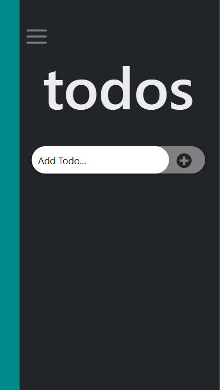
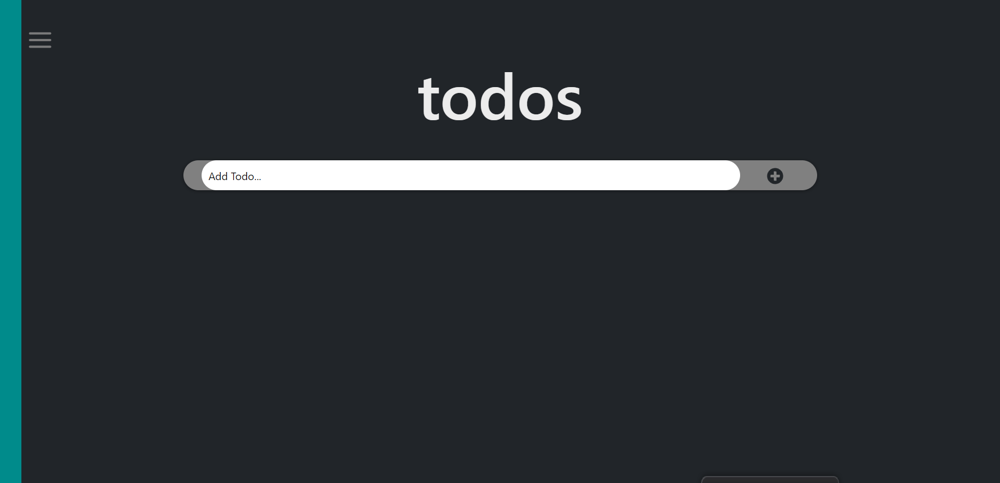

# React To Do App

React To Do App is a tool that helps to organize your day. It simply lists the things that you need to do and allows you to mark them as complete. This simple website is built using React and Bootstrap, and it has the following features:

- Adding a new item.
- Removing an added item.
- Editing a selected item.
- Marking a selected item as complete.

## Mobile

## Desktop

## Built With

- React
- Bootstrap
- VSCode
- Gitflow & GitHub

## Live Demo

[Live Demo Link](https://dicodiaz.me/react-todo-app/)

## Getting Started

To get this project up and running, follow these simple steps:

1. Clone the repository into your machine (Or download the .zip file and extract).
2. Open the project's folder.
3. Run `npm install`
4. Run `npm start`

### Prerequisites

- Any modern web browser.
- Any source-code editor (VSCode recommended).

### Setup

Follow the steps described before.

## Authors

👤 **Dico Diaz Dussan**

- GitHub: [@dicodiaz](https://github.com/dicodiaz)
- Twitter: [@DicoDiaz1](https://twitter.com/DicoDiaz1)
- LinkedIn: [Dico Diaz Dussan](https://www.linkedin.com/in/dico-diaz-dussan-476106a6/)

## 🤝 Contributing

Contributions, issues, and feature requests are welcome!

Feel free to check the [issues page](../../issues/).

## Show your support

Give a ⭐️ if you like this project!

## Acknowledgments

- ibaslogic's [React Tutorial From Scratch](https://ibaslogic.com/react-tutorial-for-beginners/)
- [Microverse](https://www.microverse.org)

## 📝 License

This project is [MIT](./MIT.md) licensed.
